# ✈️ VoyageAI — Travel & Immigration Intelligence Assistant

[](https://www.python.org/downloads/)
[](https://streamlit.io/)
[](https://github.com/facebookresearch/faiss)
[](https://github.com/dorianbrown/rank_bm25)
[]()
[]()

**VoyageAI** is a competition-grade, enterprise-ready **Travel & Immigration Intelligence Assistant** built to provide accurate, grounded, authoritative, and fresh immigration advice.

Unlike simple wrapper chatbots, VoyageAI combines **Hybrid Search (Dense Vector + Sparse BM25 + Lexical Overlap)**, **Corrective Retrieval-Augmented Generation (CRAG)**, **Self-RAG Grounding Verification**, **Structured Query Understanding**, **Multi-Layer Guardrails**, and an interactive **Travel Readiness Scoring Engine**.

---

## 📌 Table of Contents
1. [System Architecture](#-system-architecture)
2. [End-to-End Execution Flow](#-end-to-end-execution-flow)
3. [Key Features & Differentiation](#-key-features--differentiation)
4. [Authoritative Knowledge Base](#-authoritative-knowledge-base)
5. [Directory Structure](#-directory-structure)
6. [Installation & Setup](#-installation--setup)
7. [Running the Application](#-running-the-application)
8. [Evaluation & Testing](#-evaluation--testing)
9. [Security & Guardrails](#-security--guardrails)
10. [Future Roadmap](#-future-roadmap)

---

## 🏛️ System Architecture

VoyageAI is organized into **4 clean modular layers** ensuring clear separation of concerns between ingestion, security, retrieval intelligence, and presentation.


---

## 🔄 End-to-End Execution Flow

Every user prompt follows a clear **5-Stage Pipeline** with automated self-correction, grounding checks, and transparent source attribution.

```mermaid
flowchart LR
    %% Flow definition
    classDef step fill:#0f172a,stroke:#38bdf8,stroke-width:2px,color:#f8fafc;
    classDef branch fill:#1f2937,stroke:#fbbf24,stroke-width:2px,color:#fefce8;
    classDef pass fill:#064e3b,stroke:#34d399,stroke-width:2px,color:#ecfdf5;
    classDef reject fill:#7f1d1d,stroke:#f87171,stroke-width:2px,color:#fef2f2;

    %% STAGES
    subgraph S1["STAGE 1: Security & Guardrails"]
        direction TB
        Q["User Query Received"]:::step --> G{"Input Guardrail"}:::branch
        G -->|Harmful / Jailbreak| R1["🛑 Security Policy Alert"]:::reject
        G -->|Out of Domain| R2["ℹ️ Travel Domain Redirection"]:::reject
        G -->|Legitimate Travel / Follow-up| P["Pass to Parser"]:::pass
    end

    subgraph S2["STAGE 2: Query Understanding"]
        direction TB
        P --> Parse["Extract Trip Parameters"]:::step
        Parse --> Ctx["Structured Context:<br>• Origin Country<br>• Destination Country<br>• Purpose & Duration<br>• Question Type"]:::step
    end

    subgraph S3["STAGE 3: Hybrid Retrieval & CRAG"]
        direction TB
        Ctx --> Ret["⚡ Hybrid Retrieval<br><i>FAISS + BM25 + Boost</i>"]:::step
        Ret --> Eval{"Relevance Score >= 0.35?"}:::branch
        Eval -->|Weak Evidence| Retry["🔄 Query Reformulation & 2nd Retrieval"]:::step
        Retry --> Ret
        Eval -->|High Confidence| Docs["Grounded Documents"]:::pass
        Eval -->|No Data Available| Fallback["⚠️ Safe No-Evidence Notice"]:::reject
    end

    subgraph S4["STAGE 4: LLM Generation & Self-RAG"]
        direction TB
        Docs --> Gen["🤖 LLM Generation<br><i>Streamed Factual Response</i>"]:::step
        Gen --> Val{"Self-RAG Grounding"}:::branch
        Val -->|Grounded| Out["Sanitized Answer + Disclaimer"]:::pass
        Val -->|Hallucination Detected| Fallback
    end

    subgraph S5["STAGE 5: Output Assembly"]
        direction TB
        Out --> Res["Render to UI:<br>• 💬 Progressive Answer<br>• 📊 Travel Readiness Score<br>• 📚 Verified Source Links<br>• 🔍 'Why this answer?'"]:::pass
    end

    %% Inter-stage connections
    S1 ==> S2
    S2 ==> S3
    S3 ==> S4
    S4 ==> S5
```



---

### 📋 Step-by-Step Breakdown

```
┌────────────────────────────────────────────────────────────────────────────────────────┐
│ 1. INPUT SAFETY CHECK                                                                  │
│    • Prompt Injection (e.g. "Ignore instructions", "DAN mode") ──► Refusal Alert       │
│    • Dangerous / Hazardous Requests (e.g. explosives, weapons) ──► Policy Alert        │
│    • Illegal Evasion (e.g. fake passports, border evasion)    ──► Safety Alert         │
│    • Conversational Context Tolerance (e.g. "10 days", "UK")   ──► Permitted           │
├────────────────────────────────────────────────────────────────────────────────────────┤
│ 2. ENTITY PARSING & MEMORY                                                             │
│    • Extracts: Origin 🇮🇳 India ➔ Destination 🇫🇷 France | Tourism | 10 days             │
│    • Updates isolated user session state (`SessionMemory`)                             │
├────────────────────────────────────────────────────────────────────────────────────────┤
│ 3. HYBRID RETRIEVAL (Vector + BM25 + Lexical)                                          │
│    • Score = (0.60 * Vector) + (0.30 * BM25) + (0.10 * Lexical) * DestinationBoost    │
│    • Filters documents matching destination country                                    │
├────────────────────────────────────────────────────────────────────────────────────────┤
│ 4. CORRECTIVE RAG (CRAG) EVALUATION                                                    │
│    • Checks candidate relevance against `RELEVANCE_THRESHOLD=0.35`                     │
│    • If score is weak: Reformulates search query & executes secondary retrieval       │
│    • If evidence is missing: Explicitly returns safe no-hallucination warning          │
├────────────────────────────────────────────────────────────────────────────────────────┤
│ 5. SELF-RAG GROUNDING & OUTPUT GENERATION                                              │
│    • Streams factual response progressively to Streamlit UI                            │
│    • Checks for numerical or fee hallucinations against retrieved passages             │
│    • Attaches official government verification notices                                 │
│    • Computes 5-pillar Travel Readiness Score (0–100%)                                 │
│    • Assembles "Why this answer?" explainability drawer                                │
└────────────────────────────────────────────────────────────────────────────────────────┘
```

---

## 🌟 Key Features & Differentiation

| Feature | Description |
|---|---|
| **Authoritative Government Sources** | Data curated directly from official government portals (France-Visas, Auswärtiges Amt, UKVI, US State Dept, UAE ICP, Singapore ICA, Japan MOFA, Australian Home Affairs). |
| **Hybrid Search Fusion** | Weighted score formula: `(0.60 * Vector) + (0.30 * BM25) + (0.10 * Lexical) * DestinationBoost`. |
| **Zero-Hallucination Fallback** | Explicitly refuses to guess visa rules or fees when authoritative evidence is missing. |
| **Multi-Turn Context Retention** | Remembers trip context across conversation turns without re-asking established details. |
| **Session Isolation** | Clean in-memory session boundary (`InMemorySessionStore`), ready to swap for Redis or PostgreSQL. |
| **Offline Fallback Generator** | Includes deterministic grounded template generation when running without an OpenAI API key. |
| **Premium Streamlit UI** | Modern deep navy dashboard with real-time streaming, country badges, progress gauges, and collapsible source cards. |

---

## 🏛️ Authoritative Knowledge Base

VoyageAI contains pre-indexed official immigration knowledge for major global destinations:

- 🇫🇷 **France**: Short-Stay Schengen Type C Visa, €90 fees, 15–45 day processing, €30k insurance rules.
- 🇩🇪 **Germany**: VIDEX application requirements, biometrics, blocked account / Verpflichtungserklärung.
- 🇬🇧 **United Kingdom**: Standard Visitor Visa (£115), 3-week processing, financial documentation.
- 🇺🇸 **United States**: B1/B2 Visitor Visa ($185 MRV fee), DS-160 application, 214(b) ties to home country.
- 🇦🇪 **UAE (Dubai/Abu Dhabi)**: 30/60-day tourist visas, GCC entry rules, 14-day VoA facility for Indian passport holders with US/UK/EU visas.
- 🇸🇬 **Singapore**: SG Arrival Card (SGAC), Level I/II assessment countries, Form 14A, SGD $30 fee.
- 🇯🇵 **Japan**: Short-Term Tourist Visa, Japan eVISA portal, Visit Japan Web immigration/customs QR.
- 🇦🇺 **Australia**: Visitor Visa Subclass 600 (Tourist Stream), AUD $190 fee, biometrics.

---

## 📂 Directory Structure

```
voyage_AI/
├── app/
│   ├── __init__.py
│   ├── config.py                 # Configuration & environment loader (.env)
│   ├── logging_config.py         # Structured logging configuration
│   ├── chatbot.py                # Core TravelImmigrationChatbot engine & streaming
│   ├── runtime.py                # Singleton runtime manager
│   ├── main.py                   # Premium Streamlit UI application
│   │
│   ├── guardrails/               # Security & domain enforcement
│   │   ├── __init__.py
│   │   ├── injection_detector.py # Prompt injection & weapons/harm detector
│   │   ├── input_guardrail.py    # Domain scope & conversational tolerance
│   │   └── output_guardrail.py   # Output sanitizer & disclaimer manager
│   │
│   ├── ingestion/                # Knowledge ingestion pipeline
│   │   ├── __init__.py
│   │   ├── models.py             # TravelDocument & TravelSource Pydantic models
│   │   ├── sources.py            # Official immigration source registry
│   │   ├── cleaner.py            # Text cleaner & Unicode normalizer
│   │   ├── extractor.py          # HTML & PDF (pypdf) extractors
│   │   ├── scraper.py            # Playwright / Requests ethical scraper
│   │   └── pipeline.py           # Ingestion pipeline runner
│   │
│   ├── rag/                      # RAG & Retrieval Engine
│   │   ├── __init__.py
│   │   ├── embeddings.py         # OpenAI & Deterministic Hash embeddings
│   │   ├── indexer.py            # FAISS vector store & BM25Okapi indexer
│   │   ├── hybrid_retriever.py   # Hybrid fusion retriever
│   │   ├── retrieval_quality.py  # Lexical overlap scoring
│   │   ├── query_rewriter.py     # Domain keyword expansion
│   │   ├── query_understanding.py# Structured TripContext extractor
│   │   ├── corrective_rag.py     # Corrective RAG evaluation & retry engine
│   │   ├── grounding_checker.py  # Self-RAG groundedness validator
│   │   ├── readiness_calculator.py# Travel Readiness Score (0-100%)
│   │   ├── prompts.py            # Grounded system prompts & templates
│   │   └── source_formatter.py   # Citation & XML context formatting
│   │
│   ├── memory/                   # Conversational memory abstraction
│   │   ├── __init__.py
│   │   └── session_memory.py     # Session-isolated memory store
│   │
│   ├── evaluation/               # Automated benchmark evaluation
│   │   ├── __init__.py
│   │   ├── datasets.py           # Curated travel & adversarial test cases
│   │   ├── metrics.py            # Accuracy & latency metrics
│   │   └── evaluator.py          # Evaluation runner
│   │
│   └── observability/            # LangSmith tracing (optional)
│       ├── __init__.py
│       └── langsmith.py
│
├── data/
│   └── travel/
│       ├── seed_data.py          # Seed authoritative documents
│       └── processed/            # Processed TravelDocument JSON files
│
├── indexes/                      # Generated FAISS & BM25 binary indexes
│   ├── faiss_index/
│   ├── bm25_index.pkl
│   └── metadata.json
│
├── tests/                        # Comprehensive PyTest test suite (22 tests)
│   ├── test_guardrails.py
│   ├── test_query_understanding.py
│   ├── test_retrieval.py
│   ├── test_corrective_rag.py
│   ├── test_memory.py
│   └── test_chatbot.py
│
├── .env.example
├── requirements.txt
├── run.py                        # Python execution entrypoint
└── README.md
```

---

## ⚙️ Installation & Setup

### 1. Clone & Set Up Virtual Environment
```bash
git clone <repo-url>
cd voyage_AI

python3 -m venv .venv
source .venv/bin/activate
```

### 2. Install Dependencies
```bash
pip install --upgrade pip
pip install -r requirements.txt
```

*(Optional) Install Playwright Chromium for dynamic browser scraping:*
```bash
playwright install chromium
```

### 3. Environment Configuration
Copy `.env.example` to `.env`:
```bash
cp .env.example .env
```

Edit `.env` to configure your API keys:
```ini
APP_NAME=VoyageAI
APP_ENV=development
LOG_LEVEL=INFO

# OpenAI API Settings
OPENAI_API_KEY=sk-your-openai-key-here
OPENAI_MODEL=gpt-4o-mini
OPENAI_EMBEDDING_MODEL=text-embedding-3-small

# RAG & Chunking Parameters
CHUNK_SIZE=800
CHUNK_OVERLAP=150
RETRIEVAL_TOP_K=6
RELEVANCE_THRESHOLD=0.35

# Hybrid Weights
VECTOR_WEIGHT=0.60
BM25_WEIGHT=0.30
LEXICAL_WEIGHT=0.10

# Optional LangSmith Tracing
LANGCHAIN_TRACING_V2=false
LANGCHAIN_API_KEY=
LANGCHAIN_PROJECT=voyageai
```

---

## 🚀 Running the Application

### 1. Ingest Knowledge & Build Indexes (Initial Setup)
```bash
# Ingest authoritative knowledge documents
python -m data.travel.seed_data

# Build FAISS vector store & BM25 index
python -m app.rag.indexer
```

### 2. Launch the Web Application
```bash
streamlit run app/main.py
```
*Or run using the Python launcher:*
```bash
python run.py
```
Open your browser at **`http://localhost:8501`**.

---

## 🧪 Evaluation & Testing

VoyageAI comes with a **22-test suite** covering guardrails, query understanding, hybrid retrieval, memory isolation, and corrective RAG.

### Run Unit Tests
```bash
pytest -v
```

### Run Test Coverage
```bash
pytest --cov=app --cov-report=term-missing
```

### Run Automated Benchmark Evaluator
```bash
python -m app.evaluation.evaluator
```

---

## 🛡️ Security & Guardrails

- **Zero Secret Exposure**: API keys are loaded via environment variables and never logged, sent to client UI, or committed to Git.
- **Input Guardrails**:
  - Catches instruction injection (`ignore instructions`, `reveal system prompt`).
  - Refuses malicious requests (explosives, weapons, illegal border crossing, fake passports).
  - Tolerates short conversational follow-ups (`"10 days"`, `"tourism"`) when an active trip context exists.
- **Output Guardrails**:
  - Evaluates generated responses for factual grounding.
  - Automatically appends verification disclaimers for valid travel advice while suppressing them on security refusals.

---

## Frontend 


## Guardrail Validation for Unsafe User Queries


